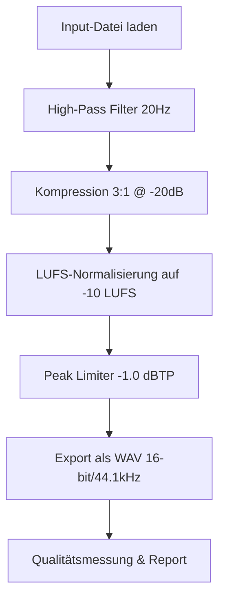

# Release 01 Plan: Audio Mastering Automation Prototyp

## Übersicht
Dieser Release implementiert einen minimalen Prototypen der Audio-Mastering-Pipeline mit Fokus auf die Kernfunktionalität: Batch-Verarbeitung von WAV/MP3-Dateien mit automatischer Mastering-Chain.

## Ziele für Release 01
- **Minimal Viable Product (MVP)**: Grundlegende Funktionalität ohne GUI oder erweiterte Features
- **Kern-Workflow**: Input-Ordner → Verarbeitung → Output-Ordner mit Report
- **Qualitätsstandards**: LUFS-Normalisierung und Peak-Limiting nach Spezifikation

## Technische Architektur

### Verarbeitungskette


### Komponenten
1. **AudioProcessor-Klasse**: Kernlogik für Signalverarbeitung
2. **BatchProcessor-Klasse**: Datei-Management und Schleifen
3. **QualityChecker-Klasse**: LUFS/True Peak Messungen
4. **ReportGenerator-Klasse**: Ausgabe-Formatierung

### Projektstruktur
```
audio-mastering/
├── mastering_tool.py          # Haupt-Script mit main()
├── audio_processor.py         # Audio-Verarbeitungsklasse
├── batch_processor.py         # Batch-Logik
├── quality_checker.py         # Messungen und Validierung
├── config.py                  # Konstanten und Konfiguration
├── requirements.txt           # Dependencies
├── README.md                  # Anleitung
├── input/                     # Input-Ordner (wird erstellt)
├── output/                    # Output-Ordner (wird erstellt)
└── logs/                      # Log-Dateien (optional)
```

## Implementierungsschritte

### Phase 1: Grundgerüst
- Projektstruktur einrichten
- requirements.txt mit minimalen Dependencies
- Basis-Klassen mit Platzhaltern

### Phase 2: Audio-Verarbeitung
- High-Pass Filter implementieren
- LUFS-Normalisierung mit pyloudnorm
- Peak-Limiter für True Peak
- Kompression (vereinfacht, ohne Sidechain)

### Phase 3: Batch-Verarbeitung
- Datei-Discovery (WAV/MP3 im input/)
- Verarbeitungsschleife mit Fortschritt
- Output-Dateien mit "_mastered" Suffix
- Fehlerbehandlung pro Datei

### Phase 4: Qualitätssicherung
- LUFS-Messung nach Verarbeitung
- True Peak Messung
- Tabellarischer Report am Ende
- Logging in Datei

### Phase 5: Konfiguration & UX
- Einfache Kommandozeilen-Argumente (input/output Pfade)
- Sinnvolle Defaults für alle Parameter
- Klare Fehlermeldungen
- Hilfe-Text

## Technologie-Stack
- **Python 3.8+** mit Type Hints
- **pyloudnorm**: ITU-R BS.1770-4 konforme LUFS-Messung
- **soundfile**: Audio I/O
- **numpy/scipy**: Signalverarbeitung
- **pathlib**: Moderne Pfad-Behandlung

## Akzeptanzkriterien
- [ ] Verarbeitet alle WAV/MP3 im input/ Ordner
- [ ] Output als WAV 16-bit/44.1kHz
- [ ] LUFS: -10.0 ±0.5 LUFS
- [ ] True Peak: ≤ -1.0 dBTP
- [ ] Report zeigt alle Messwerte
- [ ] Keine hörbaren Artefakte
- [ ] Verarbeitung < 30s für 3-5min Audio

## Risiken & Annahmen
- **Annahme**: pyloudnorm liefert korrekte LUFS-Werte
- **Risiko**: Kompression könnte Artefakte erzeugen → sanfte Parameter
- **Risiko**: Performance bei großen Dateien → Chunk-Verarbeitung falls nötig

## Nächste Schritte
Nach Genehmigung dieses Plans wird zum Code-Modus gewechselt für die Implementierung.